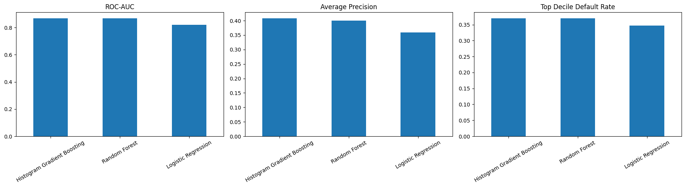
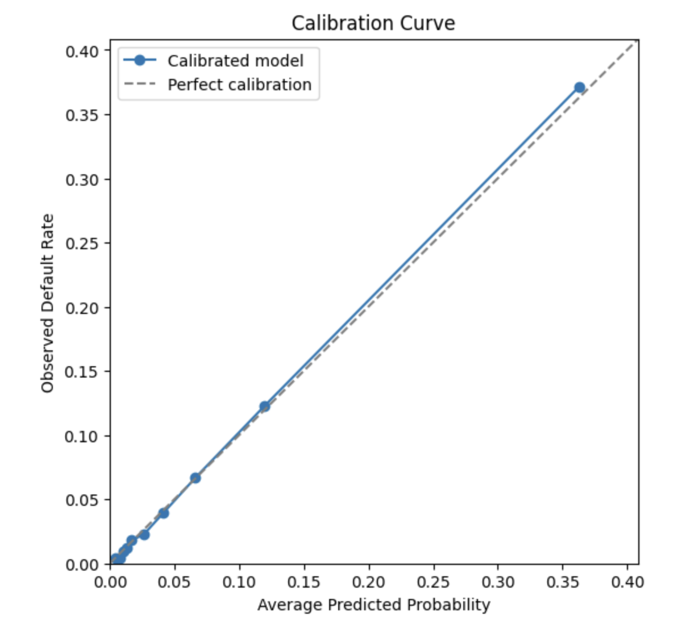
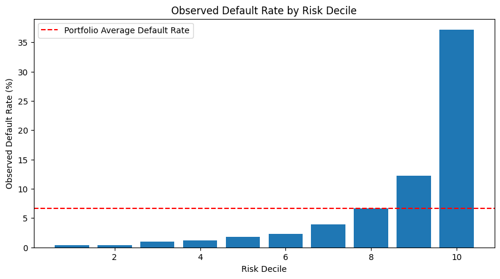

# Credit Risk Model Validation

An end-to-end credit risk modelling and model validation project using the Give Me Some Credit dataset.

## Project Objectives

This project aims to:

- Build credit default prediction models
- Handle missing values and anomalous observations
- Compare logistic regression and tree-based models
- Evaluate model discrimination and calibration
- Analyse feature importance and model explainability
- Detect data drift and potential model risk

## Dataset

The project uses the Give Me Some Credit dataset.

Raw data is not committed to this repository.

To reproduce the project:

1. Download `cs-training.csv` from Kaggle Give Me Some Credit.
2. Place it at `data/raw/cs-training.csv`.
3. Run `python -m src.train`.

The notebooks can also be run in Google Colab by uploading `cs-training.csv` to `/content/cs-training.csv`.

## Reproduce Locally

```bash
python -m venv .venv
source .venv/bin/activate
pip install -r requirements.txt
```

Download the Kaggle Give Me Some Credit training file and place it here:

```text
data/raw/cs-training.csv
```

Train the final model and save local artifacts:

```bash
python -m src.train
```

This creates:

- `models/credit_risk_model.pkl`
- `models/model_metadata.json`

Run the API after training:

```bash
uvicorn src.api:app --reload
```

## Project Workflow

- [x] Data quality audit
- [x] Exploratory data analysis
- [x] Data preprocessing
- [x] Logistic regression baseline
- [x] Tree-based model comparison
- [x] Model calibration
- [x] SHAP explainability analysis
- [x] Data drift analysis
- [x] Model card
- [x] Reproducible training script
- [x] API scoring endpoint

## Key Results

- The best-performing model was Histogram Gradient Boosting, with test ROC-AUC of 0.868 and average precision of 0.405 after model validation.
- The calibrated validation workflow achieved a test Brier score of 0.049, indicating reasonable probability calibration for default risk ranking.
- At a 10% review-rate threshold, the selected probability cutoff was 0.176, supporting a risk-based manual review strategy.
- Population Stability Index between training and test score distributions was 0.0006, suggesting low score distribution drift in the validation sample.
- SHAP analysis identified historical delinquency, revolving credit utilization, and debt burden variables as important drivers of predicted default risk.

## Selected Figures

### Model Comparison



### Calibration



### Risk Decile Analysis



## Key Metrics

The models are evaluated using:

- ROC-AUC
- PR-AUC
- KS statistic
- Precision and Recall
- Brier Score
- Calibration Curve

## Technologies

- Python
- Pandas
- NumPy
- Scikit-learn
- Matplotlib
- Seaborn
- SHAP

## Repository Structure

```text
credit-risk-model-validation/
├── data/
│   ├── raw/
│   │   └── .gitkeep
│   └── README.md
├── notebooks/
│   ├── 01_data_audit.ipynb
│   ├── 02_exploratory_data_analysis.ipynb
│   ├── 03_data_preprocessing.ipynb
│   ├── 04_baseline_logistic_regression.ipynb
│   ├── 05_tree_model_comparison.ipynb
│   ├── 06_model_validation.ipynb
│   └── 07_shap_explainability.ipynb
├── src/
│   ├── __init__.py
│   ├── api.py
│   ├── data.py
│   ├── features.py
│   ├── evaluation.py
│   └── train.py
├── models/
│   └── README.md
├── reports/
│   ├── figures/
│   │   └── README.md
│   ├── model_card.md
│   ├── shap_explainability.md
│   └── README.md
├── tests/
│   └── test_data.py
├── LICENSE
├── README.md
├── requirements.txt
└── .gitignore
